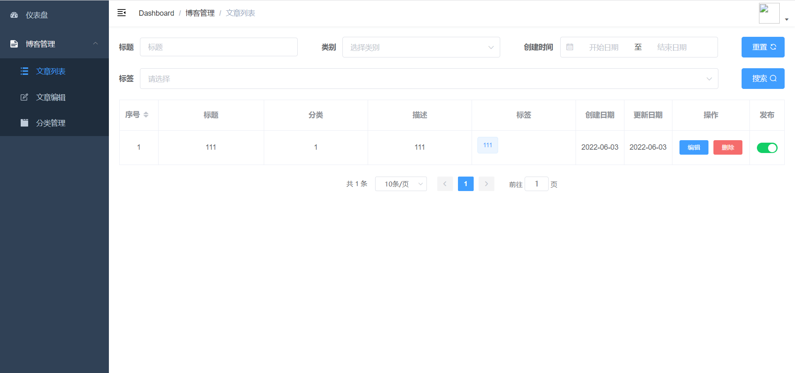
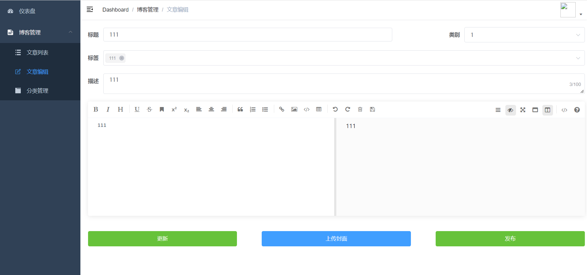
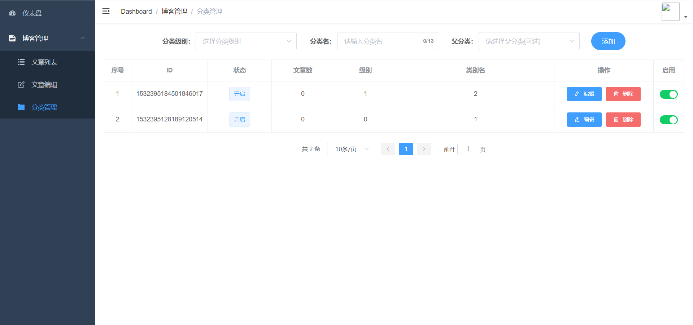
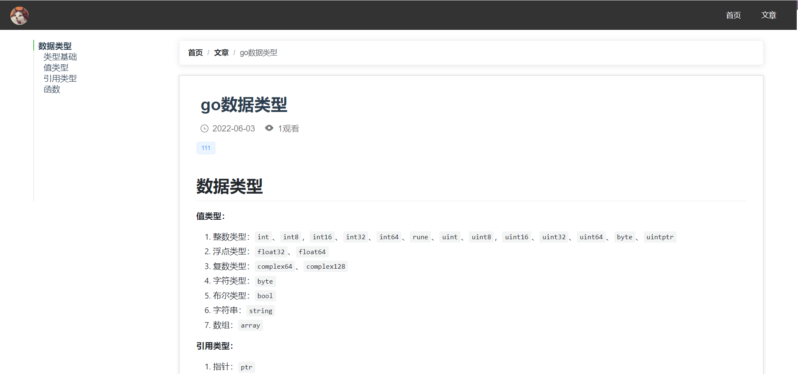

# 博客前端
大二时期学习springboot时的练手项目

## 项目启动
```
# 下载依赖
npm install

# 启动
npm run serve
```

## 使用技术
前端
- vue
- element-ui
- axios
- normalize.css

后端
- spring boot
- spring security
- mysql
- redis

## 界面
### 管理界面




### 前端界面



